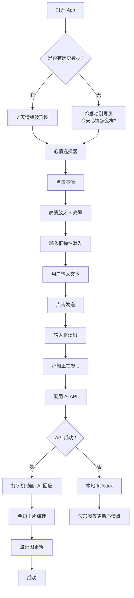
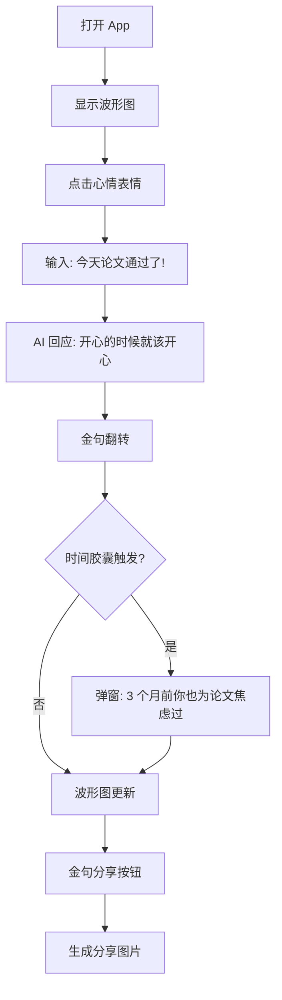
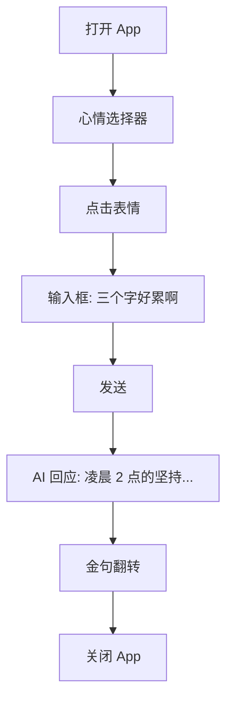
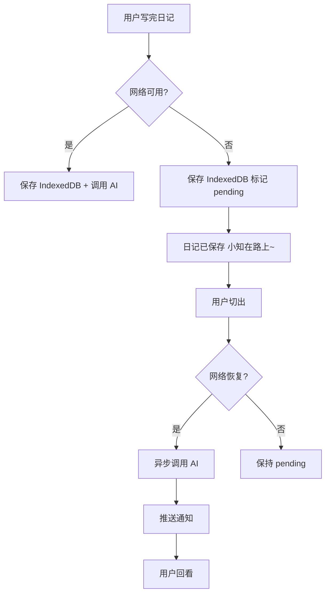

# UX Design Specification — Xiaozhi Journal

**Author:** Kei
**Date:** 2026-04-11

---

<!-- UX design content will be appended sequentially through collaborative workflow steps -->

## Executive Summary

### Project Vision

Xiaozhi Journal 是一个提供情感陪伴的 AI 日记应用。核心差异化不是"记录"，而是"被理解"。设计北极星：**评委 30 秒内被打动**——打开 App 即看到精美的波形图 + AI 金句卡片，一眼 get 到"这不是又一个日记 App"。

### Target Users

| 用户 | 特征 | UX 关键需求 |
|------|------|------------|
| 小林（28岁，PM） | 忙碌、启动成本高 | 3 秒打卡，零思考成本 |
| 小月（21岁，大学生） | 喜欢数据、爱分享 | 波形图精致、金句可传播 |
| 阿琳（32岁，新手妈妈） | 碎片化场景、情感脆弱 | 温柔不催促，移动端极简 |

### Key Design Challenges

1. **"30 秒打动评委"的视觉冲击** — 首屏必须一眼传递核心价值，不能是"又一个日记 App"的样子
2. **情感温度的视觉传达** — 从配色、字体、动效、间距，整个界面要让人"感觉温暖"，而非冷冰冰的工具感
3. **极简 vs 丰富的平衡** — 功能不多但每个都要精致；打卡入口零思考，结果展示有层次

### Design Opportunities

1. **动效叙事** — 金句卡片翻转、波形图生长、打字机效果，作为情感叙事的一部分而非纯装饰
2. **"小知"人格的 UI 具象化** — AI 不只是文字回复，通过头像、气泡风格、出现方式让它更像一个"人"
3. **情绪响应主题** — 根据用户当天心情微妙调整界面色调，增强沉浸感

## Core User Experience

### Defining Experience

Xiaozhi Journal 的核心体验是 **"3 秒心情打卡 + 被理解的回应"**。用户点开 App，选表情，写几句，然后被小知的一句话打动。这是产品的灵魂动作——如果这个环节做不好，其他所有功能都无意义。

整个体验的节奏：**看见 → 表达 → 被理解 → 共鸣**。每一步都有对应的视觉和情感锚点。

### Platform Strategy

| 维度 | 决策 |
|------|------|
| 目标平台 | Web App（Next.js），桌面浏览器优先（Chrome/Edge） |
| 交互方式 | 鼠标 + 键盘，兼顾移动端设计 |
| 离线能力 | IndexedDB 本地存储，断网可写日记，AI 异步回调 |
| 动效能力 | CSS 动画 + Framer Motion：波形图、翻转卡片、打字机 |
| 设备限制 | 不需要摄像头/麦克风，纯视觉 + 文本交互 |

### Effortless Interactions

| 交互 | 设计标准 |
|------|----------|
| 心情打卡 | 打开 App 第一眼看到 5 个表情，无需说明即可操作 |
| 写日记 | 输入框自然出现，非命令式文案 |
| 看回应 | AI 回应像聊天一样自然流出，无需额外点击 |
| 看波形图 | 无需图例或教程，一看就懂 |

### Critical Success Moments

1. **第一次打开的 3 秒** — 评委/用户看到的不能是空白输入框，必须是"哇，这好特别"
2. **AI 回应出现的那一刻** — 动效 + 文案都要打动人，不能像客服话术
3. **金句卡片翻转** — "截图时刻"，必须精致到值得分享

### Experience Principles

| 原则 | 含义 |
|------|------|
| **情感先于功能** | 先让人"感觉好"，再让人"用得好" |
| **零学习成本** | 每个交互都不需要解释，直觉驱动 |
| **动效即叙事** | 动画不是装饰，是情感表达的一部分 |
| **留白即温柔** | 大空间、少文字、慢节奏，界面本身让人放松 |
| **精致到像素** | MVP 功能少，所以每个像素都要经得起看 |

## Desired Emotional Response

### Primary Emotional Goals

| 阶段 | 目标情绪 | 对应体验 |
|------|----------|----------|
| 第一次打开 | 好奇 → "这是什么？好特别" | 首屏波形图 + 温暖的欢迎文案 |
| 选表情打卡 | 轻松 → "这个简单" | 表情大而清晰，点击有微妙反馈 |
| 写日记 | 安全 → "这里可以畅所欲言" | 输入框温和无压力，文案像朋友在问 |
| 看到 AI 回应 | 被理解 → "这话说得太准了" | 打字机动画 + 小知头像/气泡 |
| 金句翻转 | 惊喜 → "哇，这句好美" | 卡片翻转动画，金句排版精致 |
| 离开后回想 | 温暖 → "我想明天再来" | 整体色调柔和，余韵感 |

### Emotional Journey Mapping

体验节奏：**看见 → 表达 → 被理解 → 共鸣**。

1. **初见（冷启动）：** 不是空白输入框，而是"今天心情怎么样？"+ 5 个表情。用户第一眼感受到"这不像个工具，更像一个空间"
2. **表达（写日记）：** 输入框温和弹出，引导语是"随便写点什么吧，哪怕只有一句话"——降低压力
3. **回应（AI 互动）：** 打字机动画掩盖等待时间，"小知正在想..."让等待本身成为情感体验
4. **共鸣（金句卡片）：** 翻转动画揭示金句，是体验的高潮——"aha moment"
5. **余韵（离开后）：** 整体色调柔和，关闭时不是突然黑屏，而是有一种"明天再来"的期待

### Micro-Emotions

| 微情绪 | 场景 | 设计处理 |
|--------|------|----------|
| **期待感** | 等待 AI 回应 | 打字机动画 + "小知正在想..."，不是冷 loading spinner |
| **安心感** | 网络断开 | "日记已保存，小知在路上~"，不是红色报错 |
| **成就感** | 连续记录几天 | 波形图逐渐"长出来"，有视觉积累感 |
| **被惦记** | 时间胶囊弹出旧日记 | 动态时间文案（"一年前/半年前/几个月前"），意外惊喜 |
| **不舍感** | 关掉 App 时 | 温柔的告别文案，不是突然黑屏 |

### Emotions to Avoid

| 负面情绪 | 触发场景 | 如何避免 |
|----------|----------|----------|
| 焦虑 | 加载太慢、操作失败 | 所有等待都有意义，所有失败都有温度 |
| 被评判 | AI 回应像打分/分析 | AI 语气严格遵循"朋友"而非"医生" |
| 压迫感 | 界面信息密度过高 | 大量留白，每屏只做一件事 |
| 迷失感 | 不知道下一步做什么 | 每个状态都有明确的下一步引导 |

### Design Implications

| 情绪目标 | 对应的设计决策 |
|----------|----------------|
| 温暖 | 圆角 > 直角，暖色调（米白/柔粉/暖灰），手写体风格字体 |
| 安全 | 大留白，无弹出/催促，输入框是聊天气泡而非表单样式 |
| 惊喜 | 金句卡片翻转动画（3D transform），波形图有弹性动画 |
| 被理解 | AI 回应区域有人格化元素（头像、名字、气泡尾） |
| 放松 | 页面过渡用淡入淡出，不是硬切；滚动有惯性阻尼感 |

### Emotional Design Principles

| 原则 | 含义 |
|------|------|
| **等待即情感** | 不消灭等待，而让等待有意义——打字机动画让"小知在想"本身就是一种陪伴 |
| **失败也温柔** | 没有红色报错，没有"操作失败"，只有"小知暂时不在，稍后再来看看" |
| **每屏一件事** | 不堆功能，每屏只引导用户做一个动作，降低认知负荷 |
| **细节见用心** | 一个微妙的 hover 动效、一句不经意的文案，都是"被重视"的信号 |

## UX Pattern Analysis & Inspiration

### Inspiring Products Analysis

| 产品 | 可借鉴点 | 为什么适合我们 |
|------|----------|----------------|
| **Notion** | 零压力的编辑体验——打开就是空白，斜杠命令按需出现 | 日记输入框的自然出现方式，不命令、不催促 |
| **Headspace / Calm** | 情绪化设计的标杆——柔和插画、温暖配色、从容的语音节奏 | "小知"的回应节奏应像冥想引导一样从容 |
| **Day One** | 精美的日历视图、心情标签、时间线展示 | 数据可视化的精致度，但要更有温度 |
| **小宇宙** | 国内情感化设计标杆——评论区有人情味，进度条有叙事感 | 社区感和人情味的视觉表达 |

### Transferable UX Patterns

| 模式 | 来源 | 适用于 Xiaozhi Journal |
|------|------|------------------------|
| **渐进式披露** | Notion | 输入框不是默认展开，选表情后才出现 |
| **拟态情感图标** | Headspace | 5 个表情不是标准 emoji，是定制插画风格 |
| **时间线叙事** | Day One + 小宇宙 | 波形图不仅是数据，是"这一周的故事" |
| **打字机文本** | 各类 AI 产品 | AI 回应逐字出现，掩盖等待 + 增加"人在说话"的感觉 |
| **卡片翻转揭示** | 各种精致 H5 | 金句卡片的翻转是体验高潮 |
| **空状态即引导** | 小红书/Notion | 没有数据时不是空白，是一句温柔的邀请 |

### Anti-Patterns to Avoid

| 反模式 | 典型产品 | 为什么不适合我们 |
|--------|----------|-----------------|
| 表单式输入 | 传统日记 App | "标题+正文+标签"太像作业 |
| 数据面板感 | Day One、Notion 日历视图 | 太工具化，没有情感温度 |
| 过度引导 | 很多 Onboarding 流程 | 教程页面、箭头指引让人有压力 |
| 红色错误提示 | 几乎所有 App | 对于情感产品，红色报错太冷酷 |
| 冷 loading spinner | 通用 | 旋转圆圈是最无聊的等待方式 |

### Design Inspiration Strategy

| 策略 | 具体内容 |
|------|----------|
| **采用 Adopt** | 打字机动画、卡片翻转揭示、渐进式披露（输入框按需出现） |
| **改造 Adapt** | 波形图 — Day One 的精致度 + 更有机的生长动画；表情选择器 — 标准 emoji 改为定制插画风格 |
| **避免 Avoid** | 表单式布局、数据面板感、红色报错、过度引导、冷 loading spinner |

## Design System Foundation

### Design System Choice

**方案：TailwindCSS + shadcn/ui（基础组件）+ Aceternity UI（动效组件）**

| 层级 | 工具 | 用途 |
|------|------|------|
| 样式基础 | **TailwindCSS** | 设计 Token（色板、间距、圆角、字体）、布局工具类 |
| 基础组件 | **shadcn/ui** | Button、Card、Dialog、Input、Textarea 等——源码级可控 |
| 动效组件 | **Aceternity UI** | 打字机效果、3D 卡片、背景装饰——"惊艳"效果的快速实现 |

### Rationale for Selection

| 因子 | 我们的情况 | 对应选择 |
|------|------------|----------|
| 速度 | 2 小时 MVP | shadcn/ui + Aceternity 提供开箱即用组件 |
| 视觉独特性 | 比赛场景，需要"惊艳" | Aceternity 的动效组件（Text Generate、3D Card） |
| 技术栈 | Next.js + TailwindCSS | 两者都原生支持，零额外依赖 |
| 定制化 | 情感化温暖主题，需改颜色/圆角 | Tailwind Token 层完全可控 |
| 团队规模 | 1 人全栈 | 组件源码直接改，无需学习复杂 API |

### Implementation Approach

1. **Tailwind 配置层** — 定义温暖主题色板：
   - Primary：柔和暖色（如 `#F5E6D3` 米白、`#E8C4A0` 柔棕）
   - Accent：点缀色（如 `#D4856A` 暖珊瑚）
   - Background：温暖的浅色渐变
   - Text：深暖灰而非纯黑（如 `#3D3D3D`）
   - 圆角放大（`rounded-2xl` / `rounded-3xl` 为主）
   - 字体：标题用有温度的 Serif 或手写风格，正文用干净的 Sans

2. **shadcn/ui** — 安装基础组件后按需修改样式：
   - Card → 用于金句展示区，加大圆角和阴影柔和度
   - Dialog → 用于时间胶囊弹窗
   - Button → 发送按钮，温暖色调
   - Textarea → 日记输入框，聊天气泡风格

3. **Aceternity UI** — 复制需要的动效组件到项目中：
   - `Text Generate Effect` — AI 回应逐字出现
   - `3D Card` — 金句卡片翻转/悬停效果
   - 自定义波形图组件（自绘或基于 Framer Motion）

### Customization Strategy

| 定制项 | 实现方式 |
|--------|----------|
| 温暖色板 | Tailwind `theme.extend.colors` 中自定义 |
| 圆角系统 | Tailwind `theme.extend.borderRadius` 放大 |
| 打字机动画 | Aceternity Text Generate Effect + 自定义速度 |
| 金句翻转 | Aceternity 3D Card + CSS 3D transform |
| 表情图标 | 定制 SVG 插画（非标准 emoji），用 Figma 或手写 |
| 波形图 | 自绘 SVG/Canvas + Framer Motion 弹性动画 |

## Defining Core Experience

### Defining Experience

用一句话概括 Xiaozhi Journal 的核心体验：

> **"选个表情，写几句，然后被一句话打动。"**

这不是"写日记"，这是**表达后被理解**的瞬间。如果这个环节做到了完美，用户会自然产生留存、分享、复购等所有期望的行为。

### User Mental Model

| 维度 | 用户现有心智 | 我们的心智设计 |
|------|-------------|----------------|
| 写日记 | "我要坐下来认真写" → 压力大 | "随便写点什么，哪怕一句话" → 零压力 |
| AI 回应 | "它会分析我的情绪" → 冰冷 | "小知在对我说心里话" → 温暖 |
| 看数据 | "这是一堆统计图表" → 工具感 | "这是我一周的心情故事" → 叙事感 |
| 金句 | "这是系统生成的话" → 无感 | "这话说得太准了，我要保存" → 共鸣 |

### Success Criteria

| 标准 | 可感知的信号 |
|------|-------------|
| **"就是它"** | 用户看到金句后停顿 2-3 秒，然后截图或收藏 |
| **"这很自然"** | 用户不会觉得"我在用一个 App"，而是"我在跟一个朋友说话" |
| **"我还想说"** | 用户主动写第二篇日记 |
| **"我想分享"** | 用户主动把金句截图发给别人 |

### Novel vs. Established Patterns

| 层面 | 类型 | 说明 |
|------|------|------|
| 表情打卡 | 已验证 | 心情选择器在各种 App 中已被广泛接受 |
| 自由文本输入 | 已验证 | 日记输入是最熟悉的心智模型 |
| AI 回应 + 金句 | 微创新 | AI 对话常见，但"三合一回应"（共情+洞察+金句）是差异化 |
| 波形图叙事 | 创新 | 不是数据面板，而是"心情故事"的有机可视化 |
| 金句卡片翻转 | 创新 | 翻转揭示作为"aha moment"的仪式化设计 |

### Experience Mechanics

核心流程：**打卡 → 写 → 发送 → 被理解 → 共鸣**

| 阶段 | 用户动作 | 系统响应 | 视觉/动效 |
|------|----------|----------|-----------|
| **1. 触发** | 打开 App | 首屏展示波形图 + "今天心情怎么样？" + 5 个表情 | 波形图缓慢呼吸动画，表情有微妙悬浮感 |
| **2. 选择** | 点击一个表情 | 表情放大 + 光晕反馈，输入框从下方弹性滑入 | 表情点击 scale(1.3) + 回弹，输入框 spring 动画 |
| **3. 表达** | 输入文本 | 输入框自适应高度，placeholder 渐隐 | 温暖的光标闪烁，无"必填"等压迫感标记 |
| **4. 发送** | 点击发送按钮 | 输入框淡出，"小知正在想..." + 打字机光标跳动 | 发送按钮涟漪反馈，文字逐字出现（掩盖 AI 等待） |
| **5. 回应** | 观看 | AI 回应文字逐字出现 → 金句卡片翻转揭示 | 打字机速度 ~50ms/字，金句卡片 3D 翻转 0.6s |
| **6. 余韵** | 截图/收藏/离开 | 波形图自动更新该日记的心情点 | 新数据点以弹性动画"生长"到波形图上 |

## Visual Design Foundation

### Color System —「暖日」

选择了**暖日** 方案 — 柔和米调，像一本精致的纸质日记本，温暖、有质感。

#### 色板

| Token | 色值 | 用途 |
|-------|------|------|
| `bg-primary` | `#FDF8F5` | 页面背景（极浅暖米白，纸张感） |
| `bg-secondary` | `#F5EDE4` | 卡片/区块背景 |
| `primary` | `#E8C4A0` | 主色（柔棕，像阳光晒过的木头） |
| `accent` | `#D4856A` | 强调色（暖珊瑚，按钮、金句高亮） |
| `accent-hover` | `#C47459` | 强调色 hover 态 |
| `text-primary` | `#3D3D3D` | 主文字（深暖灰，非纯黑） |
| `text-secondary` | `#8A817C` | 次要文字（中暖灰） |
| `text-muted` | `#B5ADA9` | 提示文字、placeholder |
| `success` | `#A8C5A0` | 柔绿（成功状态） |
| `warning` | `#E8C4A0` | 柔棕（与主色共用） |
| `error` | `#D4856A` | 暖珊瑚（替代红色，保持温度） |
| `border` | `#E8E0D8` | 边框/分隔线 |

#### 情绪 → 颜色映射（可选扩展）

| 心情 | 微调色 | 用途 |
|------|--------|------|
| 😊 开心 | 背景微暖 `#FFF8F0` | 整体色调偏暖黄 |
| 😐 平静 | 保持默认 `#FDF8F5` | 标准暖日色板 |
| 😔 难过 | 背景微冷 `#F5F3F8` | 色调偏淡紫灰 |
| 😡 烦躁 | 背景微粉 `#FFF5F5` | 柔和的暖粉调 |
| 😴 疲惫 | 背景微灰蓝 `#F5F6F8` | 安静的冷灰调 |

### Typography System

| 层级 | 字体 | 大小 | 行高 | 字重 | 用途 |
|------|------|------|------|------|------|
| h1 | `Noto Serif SC` | 2.44rem (39px) | 1.2 | 700 | 页面主标题 |
| h2 | `Noto Serif SC` | 1.95rem (31px) | 1.3 | 600 | 区块标题 |
| h3 | `Noto Serif SC` | 1.56rem (25px) | 1.4 | 500 | 卡片标题 |
| body | `Noto Sans SC` | 1rem (16px) | 1.6 | 400 | 正文、日记内容 |
| small | `Noto Sans SC` | 0.875rem (14px) | 1.5 | 400 | 次要文字、时间戳 |
| tiny | `Noto Sans SC` | 0.75rem (12px) | 1.4 | 400 | 标签、提示文字 |
| quote | `Noto Serif SC` | 1.25rem (20px) | 1.5 | 400 italic | 金句专用 |

**字阶比例：** 1.25 Major Third

**字体来源：** Google Fonts（免费、CDN 加载快）

**选择理由：**
- `Noto Serif SC` — 有文学感、像手写日记的标题，温暖不严肃
- `Noto Sans SC` — 干净、易读、对中英文混排友好

### Spacing & Layout Foundation

#### 间距系统（8px 基础）

| Token | 值 | 用途 |
|-------|-----|------|
| xs | 4px | 图标与文字间距、内边距微调 |
| sm | 8px | 相关元素间距（标签之间） |
| md | 16px | 段落间距、输入框与按钮间距 |
| lg | 24px | 卡片内边距 |
| xl | 32px | 页面左右边距、大组件间距 |
| 2xl | 48px | 大区块间距 |
| 3xl | 64px | 页面顶部留白 |

#### 圆角系统

| Token | 值 | 用途 |
|-------|-----|------|
| sm | 8px | 小按钮、标签 |
| md | 12px | 输入框、小卡片 |
| lg | 16px | 内容卡片 |
| xl | 24px | 大卡片、对话框、金句卡片 |
| full | 9999px | 表情按钮、头像 |

**原则：圆角偏大，传达"友好、温柔"的气质。**

#### 阴影系统

| Token | 值 | 用途 |
|-------|-----|------|
| sm | `0 1px 3px rgba(61,61,61,0.06)` | 轻微卡片 |
| md | `0 4px 12px rgba(61,61,61,0.08)` | 悬浮卡片、金句卡片 |
| lg | `0 8px 24px rgba(61,61,61,0.12)` | 对话框、弹窗 |

**阴影色用暖灰而非纯黑，保持柔和感。**

### Layout Principles

| 原则 | 说明 |
|------|------|
| **居中单列** | 主内容区 max-width: 680px，居中，像一封信的宽度 |
| **大量顶部留白** | 第一眼看到的是呼吸感的空间（64px+），不是内容 |
| **一屏一事** | 每屏只展示一个核心交互，降低认知负荷 |
| **移动端优先** | 响应式断点：375px → 768px → 1024px+ |

### Accessibility Considerations

| 项目 | 标准 |
|------|------|
| 对比度 | 文字与背景对比度 ≥ 4.5:1（WCAG AA） |
| 字号 | 正文 ≥ 16px，小字 ≥ 12px |
| 键盘导航 | 所有交互元素可通过 Tab 键到达 |
| 焦点样式 | 焦点状态用暖珊瑚色 outline，非默认蓝色 |
| 动效 | 尊重 `prefers-reduced-motion`，提供关闭选项 |

## Design Direction Decision

### Design Direction Explored

评估了 6 个视觉方向，最终选择 **「杂志 Magazine」** 作为主设计方向。

| 方向 | 评估 | 结果 |
|------|------|------|
| 1 · 呼吸 Breathe | 极简但缺少视觉冲击 | 备选 |
| 2 · 卡片 Card | 信息清晰但偏工具化 | 淘汰 |
| 3 · 对话 Chat | 亲切感强但不够"惊艳" | 备选 |
| **4 · 杂志 Magazine** | **编辑感强、大排版、金句引用样式——最适合"30 秒打动评委"** | **✅ 选中** |
| 5 · 自然 Nature | 治愈感但渐变过多 | 淘汰 |
| 6 · 极简 Minimal | 精致但冷启动缺少内容 | 备选 |

### Chosen Direction —「杂志 Magazine」

#### 核心设计特征

| 特征 | 具体实现 |
|------|----------|
| **大字号标题** | 首屏 "今天心情怎么样？" 用 Noto Serif SC 26px+ 分三行排列 |
| **日期 + 字母间距** | 顶部日期用小字 + `letter-spacing: 2px`，营造杂志质感 |
| **金句引用样式** | 左边框 3px 暖珊瑚色 + 斜体 Serif 字体，像杂志引用语 |
| **波形极简** | 不占主导位置，化为底部细线装饰，信息密度适中 |
| **不对称布局** | 标题大字左对齐，引导文字偏移，打破常规 App 居中对齐 |

#### 元素融合

| 借用自 | 元素 | 融入方式 |
|--------|------|----------|
| **对话 Chat** | 聊天气泡式 AI 回应区 | 金句下方的小知回应用气泡样式，但保持杂志排版感 |
| **卡片 Card** | 波形图渐变填充 | 有数据后波形用优雅的渐变填充，但在杂志框架内 |
| **呼吸 Breathe** | 留白感 | 不堆元素，保持大量呼吸空间 |

### Design Rationale

选择「杂志」方向的核心原因：

1. **30 秒打动评委** — 大排版第一眼就传递"这不是又一个日记 App"的信号
2. **金句天生可分享** — 引用样式让金句看起来像杂志摘录，天然有传播欲
3. **编辑感 vs 工具感** — 竞品都是数据面板，我们做杂志封面
4. **可扩展性强** — 从 2 小时 MVP 到后续迭代，这个框架都能承载
5. **与"暖日"色板完美融合** — 米白背景 + Serif 标题 = 纸质日记本的数字升级

### Implementation Approach

| 组件 | 实现方式 |
|------|----------|
| 首页大标题 | `Noto Serif SC` 700, 26px+, 行高 1.3, 左对齐 |
| 日期行 | `Noto Sans SC` 400, 11px, `letter-spacing: 2px`, 大写 |
| 金句引用 | `border-left: 3px solid #D4856A`, `font-style: italic`, 左边距 16px |
| 波形图 | SVG `<polyline>` 细线，`stroke-width: 1.5`, 浅灰色 |
| 心情选择器 | 大圆角方形按钮，带 hover 上浮效果 |
| 页面过渡 | 淡入淡出（CSS `opacity` transition 0.3s） |

## User Journey Flows

### 旅程 1：核心成功路径（小林）



### 旅程 2：情感探索路径（小月）



### 旅程 3：碎片化路径（阿琳）



### 旅程 4：错误恢复路径



### Journey Patterns

| 模式 | 用途 | 实现 |
|------|------|------|
| **弹性出现** | 输入框、回应区、金句卡片 | Framer Motion `spring` 动画 |
| **打字机揭示** | AI 回应、引导文字 | 逐字显示 ~50ms/字 |
| **翻转揭示** | 金句展示 | CSS 3D transform 0.6s |
| **温和反馈** | 所有按钮交互 | scale + 颜色变化 |
| **底部固定引导** | 下一步引导 | 固定在视口底部 |

### Flow Optimization Principles

| 原则 | 说明 |
|------|------|
| **3 步内触达价值** | 打开 App → 选表情 → 开始写，最多 3 步 |
| **所有等待都有意义** | 打字机动画让 AI 等待变成"陪伴" |
| **错误不阻断** | 网络断了也能写日记，AI 异步回调 |
| **渐进式披露** | 冷启动页不展示波形图，数据积累后才出现 |
| **桌面端居中单列** | 所有流程在 680px 居中区域内完成，两侧留白 |

## Component Strategy

### Design System Components

| 来源 | 组件 | 用途 |
|------|------|------|
| shadcn/ui | Button, Card, Textarea, Dialog, Skeleton | 基础交互组件 |
| Aceternity UI | Text Generate Effect, 3D Card | 打字机动画、金句翻转 |

### Custom Components

#### MoodSelector（心情选择器）
- **用途**：首屏 3 秒选择心情
- **布局**：水平排列居中，56x56px，间距 16px
- **状态**：默认白底边框 / hover scale(1.15) / 选中暖珊瑚背景
- **动效**：悬停上浮 2px，点击回弹
- **无障碍**：Tab 导航 + aria-label

#### WaveChart（情绪波形图）
- **用途**：7 天情绪趋势可视化
- **尺寸**：宽 100% (max 640px)，高 120px
- **颜色**：渐变 `#A8C5A0` → `#D4856A`
- **状态**：无数据引导文案 / 有数据完整波形
- **动效**：入场生长 0.8s，新数据点弹性弹跳
- **交互**：hover 数据点显示 tooltip（独立 HTML 组件，`position: fixed` 定位，不受 SVG viewBox 裁剪限制）
- **Tooltip 规格**：`#F5EDE4` 背景 + `#E8E0D8` 边框 + `rounded-xl` + `shadow-lg`，数据点上方 8px 居中，边缘自动 clamp 防止溢出视口，Framer Motion 淡入淡出 0.15s

#### QuoteCard（金句卡片 — 杂志引用样式）
- **用途**：展示 AI 提炼的"今日金句"
- **样式**：左侧 3px 暖珊瑚装饰线，Noto Serif SC italic 20px
- **背景**：`#F5EDE4`，圆角 24px
- **动效**：3D 翻转揭示 0.6s，悬停微上浮

#### XiaozhiBubble（小知回应气泡）
- **用途**：AI 共情回应，人格化
- **布局**：左侧对齐，带气泡尾
- **字体**：Noto Sans SC 16px，行高 1.6
- **动效**：打字机逐字 50ms/字，弹性滑入

#### TypingIndicator（打字机指示器）
- **用途**：AI 调用中的等待状态
- **内容**："小知正在想..." + 三个跳动圆点
- **颜色**：暖灰 `#8A817C`

#### EmptyState（空状态引导）
- **用途**：无历史数据引导
- **内容**：插画 + "你的第一条日记从这里开始 ✨"
- **动效**：插画轻微浮动 2s 循环

#### EmotionTooltip（情绪气泡）
- **用途**：波形图数据点 hover 时显示详情
- **类型**：独立 HTML 组件（非内联 SVG）
- **定位**：`position: fixed`，通过 `getBoundingClientRect` 映射 SVG viewBox 坐标到屏幕像素
- **内容**：日期 + 心情标签 + 日记摘要（前 20 字）
- **样式**：`#F5EDE4` 背景 + `#E8E0D8` 边框 + `rounded-xl` + `shadow-lg`，`pointer-events-none`
- **交互**：hover 数据点出现，鼠标离开淡出；边缘数据点自动 clamp 防止溢出视口
- **动效**：Framer Motion 淡入淡出（opacity 0→1, y 5→0, 0.15s）

### Implementation Roadmap

| 阶段 | 组件 | 依赖旅程 |
|------|------|----------|
| **P0 核心** | MoodSelector, WaveChart, QuoteCard, XiaozhiBubble, TypingIndicator | 旅程 1 |
| **P1 扩展** | TimeCapsuleModal, EmptyState, ShareImage | 旅程 2、3 |
| **P2 增强** | 情绪响应主题色、分享图片组件 | 旅程 2 分享 |

## UX Consistency Patterns

### Button Hierarchy

| 层级 | 样式 | 用途 | 示例 |
|------|------|------|------|
| **Primary** | 暖珊瑚 `#D4856A` 实心，白字，圆角 12px | 唯一最重要操作 | "发送"日记 |
| **Secondary** | 白底 + 暖珊瑚边框，暖珊瑚文字 | 可选的次要操作 | "查看历史"、"分享金句" |
| **Tertiary** | 无背景无边框，暖珊瑚文字 | 辅助操作 | "跳过"、"稍后再说" |
| **Icon** | 无背景，hover 微灰底 | 图标操作 | 分享按钮、关闭按钮 |

**规则：** 每屏最多 1 个 Primary 按钮；Primary 始终在视觉最下方/最右侧；所有按钮 hover：背景深 5% + 微上浮。

### Feedback Patterns

| 类型 | 样式 | 出现方式 | 消失方式 |
|------|------|----------|----------|
| **成功** | 柔绿 `#A8C5A0` 背景 + 白底卡片 | 弹性滑入 | 3 秒后淡出 |
| **错误** | 暖珊瑚 `#D4856A` 背景（非红色）+ 温暖文案 | 弹性滑入 | 手动关闭或 5 秒淡出 |
| **等待** | 打字机动画 + 三个跳动圆点 | 原地出现 | 被真实内容替换 |
| **提示** | 浅米色 `#F5EDE4` 背景 + 暖灰文字 | 淡入 | 手动关闭 |

**规则：** 不用 Toast 弹窗；所有反馈内嵌内容流；错误反馈永远用温暖文案。

### Form Patterns

| 维度 | 规格 |
|------|------|
| 输入框样式 | 无外框，底部 2px 暖灰线，圆角底部 |
| Placeholder | "随便写点什么吧，哪怕只有一句话" |
| 自适应 | 高度自动增长，最多 200px，超出可滚动 |
| 字数提示 | 不显示（不制造压力） |
| 发送触发 | 点击 Primary 按钮 或 Cmd/Ctrl + Enter |
| 草稿 | 输入内容自动保存到 IndexedDB，刷新不丢失 |

### Navigation Patterns

| 维度 | 规格 |
|------|------|
| 整体结构 | 单页应用，无侧边栏/顶部导航 |
| 路由 | `/` 首页，`/history` 历史记录（P2） |
| 页面切换 | 淡入淡出 0.3s |
| 历史记录入口 | 首屏底部小链接"查看过往记录"（Tertiary 文字按钮） |

### Modal & Overlay Patterns

| 维度 | 规格 |
|------|------|
| 背景遮罩 | 半透明暖灰 `rgba(61,61,61,0.4)` + `backdrop-filter: blur(4px)` |
| 居中卡片 | 白底，圆角 24px，最大宽度 480px，居中 |
| 出现方式 | 弹性缩放（scale 0.9 → 1.0, 0.3s cubic-bezier） |
| 关闭方式 | 点击遮罩 / Esc 键 / 右上角 X 按钮 |

### Tooltip Pattern（情绪气泡）

| 维度 | 规格 |
|------|------|
| 实现方式 | 独立 HTML 组件（`emotion-tooltip.tsx`），非内联 SVG |
| 定位 | `position: fixed`，通过 `getBoundingClientRect` 映射 SVG viewBox 坐标 |
| 内容 | 日期 + 心情标签 + 日记摘要（前 20 字，超出 truncate） |
| 背景 | `#F5EDE4` + `#E8E0D8` 边框 + `rounded-xl` + `shadow-lg` |
| 位置 | 数据点上方 8px 居中，边缘自动 clamp 防止溢出视口 |
| 出现方式 | Framer Motion 淡入淡出（opacity 0→1, y 5→0, 0.15s） |
| 交互 | `pointer-events-none` 不拦截鼠标事件 |

### Empty & Loading States

| 状态 | 处理 |
|------|------|
| 冷启动（无数据） | "今天心情怎么样？" + 表情 + "你的第一条日记从这里开始 ✨" |
| API 加载中 | 打字机动画 + "小知正在想..." |
| API 失败 | "小知暂时不在，你的感受已经保存好了。稍后再来看看~" |
| 页面加载 | 骨架屏浅米色 `#F5EDE4` 闪烁 |
| 网络断开 | 顶部柔和提示条："网络连接中，日记会先保存到本地" |

### Copywriting Patterns

| 场景 | ❌ 不应使用 | ✅ 应使用 |
|------|------------|-----------|
| 错误 | "操作失败"、"网络错误" | "小知在路上~"、"稍后再来看看" |
| 引导 | "请输入您的日记内容" | "随便写点什么吧" |
| 空状态 | "暂无数据" | "这里还没有故事，开始写第一篇吧 ✨" |
| 等待 | "加载中..." | "小知正在想..." |
| 成功 | "保存成功" | "记下了 ✨" |
| 时间胶囊 | "历史匹配" | "一年前的今天/半年前/几个月前，你也这样想过"（动态文案） |

**原则：所有文案遵循"朋友语气"，不用任何技术/产品术语。**

## Responsive Design & Accessibility

### Responsive Strategy

**设计原则：桌面优先（Desktop-First），移动端优雅降级。**

比赛演示用桌面浏览器（Chrome），但用户场景（阿琳碎片化）要求移动端可用。

| 维度 | 桌面端 (1024px+) | 平板 (768px-1023px) | 移动端 (375px-767px) |
|------|------------------|---------------------|----------------------|
| 内容区宽度 | max-width: 680px 居中 | max-width: 90% 居中 | 100%，padding 20px |
| 大标题 | 32px+，3 行 | 28px，2-3 行 | 24px，2 行 |
| 心情选择器 | 水平 16px 间距，56px 按钮 | 水平 12px 间距 | 水平 8px 间距，48px 按钮 |
| 波形图 | 640px 宽 × 120px 高 | 100% 宽 × 100px 高 | 100% 宽 × 80px 高 |
| AI 气泡 | 左侧对齐 | 左侧对齐 | 左侧对齐，max-width 85% |

### Breakpoint Strategy

| 断点 | 值 | 用途 |
|------|-----|------|
| sm | 375px | 最小手机宽度 |
| md | 768px | 平板分界点 |
| lg | 1024px | 桌面起始点 |
| xl | 1280px | 大桌面，增加两侧留白 |

**使用 TailwindCSS 默认断点，不自定义。**

### Accessibility Strategy

**目标：WCAG AA 级**

| 维度 | 规格 |
|------|------|
| 颜色对比度 | 正常文字 ≥ 4.5:1，大文字 ≥ 3:1 |
| 键盘导航 | Tab 顺序从上到下，Enter 触发，Esc 关闭弹窗 |
| 焦点指示器 | 暖珊瑚色 `outline: 2px solid #D4856A`，offset 2px |
| 触摸目标 | 最小 44x44px |
| 屏幕阅读器 | 装饰图 `aria-hidden`，功能图标 `aria-label` |
| 动效降级 | 尊重 `prefers-reduced-motion`，关闭动画时直接显示 |
| 字体缩放 | 支持浏览器放大 200%，布局不崩坏 |

### Testing Strategy

| 测试类型 | 方法 |
|----------|------|
| 桌面端 | Chrome/Edge 最新版，1920x1080 和 1366x768 |
| 移动端 | Chrome DevTools 模拟 iPhone SE (375px) 和 iPhone 14 (390px) |
| 无障碍 | Lighthouse Accessibility Audit ≥ 90 分 |
| 键盘导航 | 纯键盘完成核心路径 |
| 动效降级 | 开启 `prefers-reduced-motion` 验证 |

### Implementation Guidelines

| 指南 | 说明 |
|------|------|
| 相对单位 | 字号用 `rem`，间距用 `rem` 或 `%` |
| Mobile-first 媒体查询 | 先写移动端，用 `md:`、`lg:` 断点覆盖 |
| 语义化 HTML | `<main>`, `<section>`, `<button>` 正确使用 |
| ARIA 标签 | 心情选择器 `role="radiogroup"` + `role="radio"` |
| 焦点管理 | 弹窗打开聚焦首个可交互元素，关闭返回触发点 |
| 图片优化 | SVG 用于波形图和表情图标 |

## Authentication Flow UX

> **更新**: 2026-04-27 | **对应 FR**: FR1-FR4 | **NFR**: NFR6-NFR10, NFR27-NFR29

### 设计决策

| 决策点 | 选择 | 理由 |
|--------|------|------|
| 注册流程结构 | **分步向导** — 多步渐进，每步一个焦点 | 降低认知负担，减少表单放弃率 |
| 登录页结构 | 单表单 + 找回密码入口 + 保持登录时长选择 | 简洁直接，常用操作一步到位 |
| 注册后资料设置 | **邮箱验证后追加** 昵称 + 头像，提供"以后再说"跳过 | 不强求完善，尊重用户节奏 |
| 主题切换 | **按时间自动** — 暖阳(6:00-17:59) / 星空(18:00-5:59) | 全局化，浅/深色模式自动适配 |

---

### 1. 注册流程 — 分步向导

#### 用户旅程

```
注册开始
  → Step 1: 输入邮箱（验证格式）
    → Step 2: 设置密码 + 确认密码 + 年龄确认（密码强度实时显示）
      → Step 3: 选择邮箱验证方式（链接 / OTP）
        → 发送邮件/验证码
          → 用户完成邮箱验证
            → Step 4: 设置昵称 + 头像（可"以后再说"跳过）
              → 注册完成，进入首页
```

#### 进度指示

```
[████████] [░░░░░░░░] [░░░░░░░░]     第 1 步 / 共 3 步
  邮箱        密码       验证
```

| 状态 | 颜色 | 说明 |
|------|------|------|
| 已完成 | `#A8C5A0`（柔绿） | 绿色已完成 |
| 当前步 | `#D4856A`（暖橙） | 高亮当前步骤 |
| 未到达 | `#E8E0D8`（浅灰） | 未到达步骤 |

#### Step 1: 邮箱

| 元素 | 规格 |
|------|------|
| 标题 | "你的邮箱地址" |
| 副标题 | "这个将用来登录和找回账号" |
| 输入 | 邮箱格式，实时校验 |
| 反馈 | 格式错误: `#D4856A` "邮箱格式不太对哦~" |
| 反馈 | 格式正确: `#A8C5A0` "✓ 邮箱格式正确" |
| 下一步 | 邮箱有效时按钮可点击 |

#### Step 2: 密码

| 元素 | 规格 |
|------|------|
| 标题 | "设置密码" |
| 副标题 | "至少 8 位，越复杂越安全" |
| 输入 1 | 密码输入 |
| 强度指示器 | 5 段条状，弱 2 段/中 3 段/强 5 段 |
| 输入 2 | 确认密码，实时比对 |
| 校验 | 两次不一致: `#D4856A` "两次密码不太一样哦~" |
| 年龄确认 | Checkbox "我已年满 18 岁" |

密码强度规则:

| 级别 | 条件 | 颜色 | 文案 |
|------|------|------|------|
| 弱 | < 8 位 | `#D4856A` | "再加几位吧~" |
| 中 | ≥ 8 位，部分复杂度 | `#B5ADA9` | "还不错，加点复杂度？" |
| 强 | ≥ 8 位 + 大小写 + 数字 | `#A8C5A0` | "这就很安全了 ✨" |

#### Step 3: 验证方式选择

| 元素 | 规格 |
|------|------|
| 标题 | "选择验证方式" |
| 副标题 | "哪种方式更适合你？" |
| 选项 A | "点击邮件链接确认" — 简单快捷，一键验证 |
| 选项 B | "输入 6 位验证码" — 更安全，适合敏感操作 |
| 默认 | 链接模式预选中 |
| 底部 | 显示将发送到的邮箱地址 |

---

### 2. 登录流程

#### 页面结构

```
┌────────────────────────────────┐
│       Xiaozhi Journal          │
│   ┌──────┐  ┌──────┐          │
│   │ 注册  │  │ 登录✦ │          │
│   └──────┘  └──────┘          │
│                                │
│  ┌─────────────────────────┐  │
│  │  邮箱                    │  │
│  │  ____________________   │  │
│  │  密码                    │  │
│  │  ____________________   │  │
│  │           忘记密码？      │  │
│  │                         │  │
│  │  保持登录                │  │
│  │  [不保持][24h][7d][30d]  │  │
│  │                         │  │
│  │  ┌───────────────────┐  │  │
│  │  │       登录         │  │  │
│  │  └───────────────────┘  │  │
│  └─────────────────────────┘  │
│                                │
│  还没有账号？ 去注册            │
└────────────────────────────────┘
```

#### 保持登录时长选择

| 选项 | Session 时长 | 适用场景 |
|------|-------------|---------|
| 不保持 | 浏览器关闭即过期 | 公共设备 |
| 24 小时 | 24h | 临时借用设备 |
| 7 天 (默认) | 7d | 个人常用设备 |
| 30 天 | 30d | 信任设备，免登录 |

- 按钮式选择器，选中项高亮 `#D4856A`
- 未选中项 `bg-white/60` + `#B5ADA9` 文字
- 默认值 7 天

#### 找回密码入口

- 登录表单内右上角: "忘记密码？" 链接
- 点击后切换为独立找回密码页面
- 输入注册邮箱 → 发送重置链接 → 确认发送成功 → 返回登录

---

### 3. 注册后资料设置（验证邮箱后）

#### 用户旅程

```
邮箱验证成功
  → 进入资料设置页
    → 选择头像（6 个预设 emoji 头像）
    → 输入昵称
    → 两个选项:
       A) "开始写日记 ✨" — 完成注册
       B) "以后再说" — 跳过，进入首页（使用默认资料）
```

#### 头像选择器

```
选择头像
[🐱] [🌻] [🌙] [☕] [🐾] [✨]

当前选择: 🐱
```

| 元素 | 规格 |
|------|------|
| 布局 | 6 格网格，每格一个 emoji |
| 选中态 | 白色底 + `#D4856A` 边框 + scale-110 |
| 未选中 | 半透明白底 + 透明边框 |
| hover | 边框变为 `#E8E0D8` |

#### 昵称输入

| 元素 | 规格 |
|------|------|
| 标签 | "昵称" |
| Placeholder | "怎么称呼你？" |
| 校验 | 至少 1 个字符 |
| 必填 | 仅点击"开始写日记"时必填 |

#### 操作按钮

| 按钮 | 样式 | 行为 |
|------|------|------|
| "以后再说" | 次要按钮 `#E8E0D8` 背景 | 跳过资料设置，使用默认资料进入首页 |
| "开始写日记 ✨" | 主按钮 `#D4856A` 背景 | 昵称填写后才可点击，完成注册 |

---

### 4. 全局主题系统 — 暖阳/星空自动切换

#### 设计概念

基于当前时间自动切换浅/深色主题，同时作为浅色模式与深色模式的统一方案。

#### 时间规则

| 时段 | 主题 | 模式 | 时间范围 |
|------|------|------|---------|
| 暖阳 | Light | 浅色模式 | 06:00 — 17:59 |
| 星空 | Dark | 深色模式 | 18:00 — 05:59 |

#### 色板映射

| 元素 | 暖阳 (Light) | 星空 (Dark) |
|------|-------------|-------------|
| 页面背景 | `#FDF8F5` | `#0F1B2D` |
| 卡片背景 | `#F5EDE4` | `#1A2A3F/80` + backdrop-blur |
| 主文字 | `#1F2937` (gray-800) | `#E8D5B5` |
| 弱化文字 | `#B5ADA9` | `#6B8299` |
| 主按钮 | `#E8C4A0` | `#F5C77A/20` + 边框 |
| 强调色 | `#D4856A` | `#F5C77A` |
| 成功色 | `#A8C5A0` | `#7AC77A` |
| 错误色 | `#D4856A` | `#E87A5A` |
| 边框色 | `#E8E0D8` | `#1E3044` |

#### 实现建议

```tsx
// 推荐: CSS 变量 + 时间检测
// layout.tsx 中检测时间，注入 html class
function getTimeTheme() {
  const hour = new Date().getHours();
  return hour >= 6 && hour < 18 ? 'warm-sun' : 'starry-night';
}

// Tailwind 用 CSS 变量引用
// :root.warm-sun { --bg-primary: #FDF8F5; ... }
// :root.starry-night { --bg-primary: #0F1B2D; ... }
```

#### 手动覆盖

- 设置页提供"手动切换主题"选项
- 覆盖后不再自动切换
- 提供"恢复自动切换"按钮

---

### 5. 组件规格

#### 5.1 进度条 (Step Progress Bar)

```
[████████] [░░░░░░░░] [░░░░░░░░]
```

| 属性 | 规格 |
|------|------|
| 高度 | 6px (`h-1.5`) |
| 圆角 | `rounded-full` |
| 段数 | 等于步骤数 |
| 已完成 | `#A8C5A0` |
| 当前步 | `#D4856A` |
| 未到达 | `#E8E0D8` |
| 标签 | 每步下方 9px 文字 |

#### 5.2 密码强度指示器

```
[██][░░][░░][░░][░░] 再加几位吧~
```

| 级别 | 亮段数 | 颜色 |
|------|--------|------|
| 弱 | 2 段 | `#D4856A` |
| 中 | 3 段 | `#B5ADA9` |
| 强 | 5 段 | `#A8C5A0` |

#### 5.3 保持登录时长选择器

```
[不保持]  [24 小时]  [7 天]  [30 天]
```

| 状态 | 背景 | 文字 | 边框 |
|------|------|------|------|
| 选中 | `#D4856A` | 白色 | `#D4856A` |
| 未选中 | `white/60` | `#B5ADA9` | `#E8E0D8` |

#### 5.4 头像选择器

```
[🐱] [🌻] [🌙] [☕] [🐾] [✨]
  ^ 选中: 白底 + 橙边框 + scale-110
```

| 元素 | 规格 |
|------|------|
| 布局 | 6 格 grid |
| 图标 | emoji，2xl 字号 |
| 选中 | `bg-white/80 border-2 border-[#D4856A] scale-110` |

---

### 6. 交互流程汇总

#### 注册全流程

```
┌─────────────┐    ┌─────────────┐    ┌─────────────┐
│  Step 1     │ →  │  Step 2     │ →  │  Step 3     │
│  邮箱       │    │  密码       │    │  验证方式    │
│  格式校验   │    │  强度指示    │    │  链接/OTP   │
└─────────────┘    └─────────────┘    └─────────────┘
                                              │
                                              ▼
┌─────────────┐    ┌─────────────┐    ┌─────────────┐
│ 完成 → 首页  │ ←  │ 资料设置    │ ←  │ 邮件验证    │
│ 或跳过       │    │ 昵称/头像   │    │ 成功        │
└─────────────┘    └─────────────┘    └─────────────┘
```

#### 登录全流程

```
┌─────────────┐
│  登录页      │
│  邮箱+密码   │
│  保持时长    │
└──────┬──────┘
       │
   ┌───┴───┐
   ▼       ▼
┌──────┐  ┌─────────────┐
│ 登录  │  │ 忘记密码？   │
│ 成功  │  │ 输入邮箱     │
│ → 首页│  │ 发送链接     │
└──────┘  └─────────────┘
```
